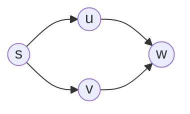
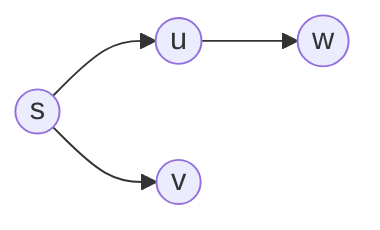
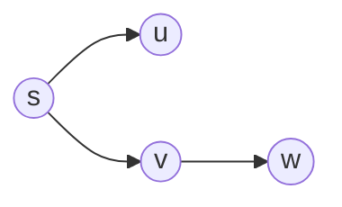
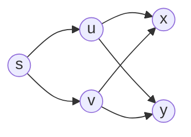
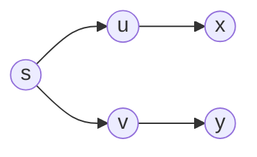
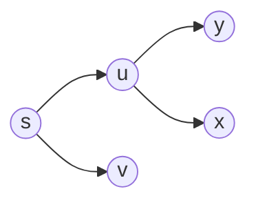
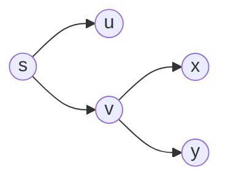
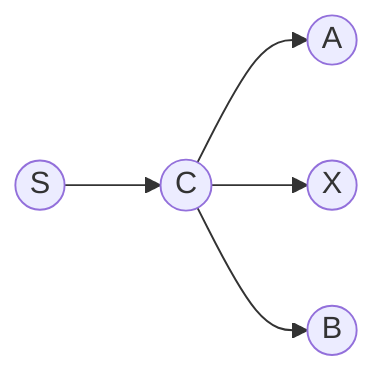
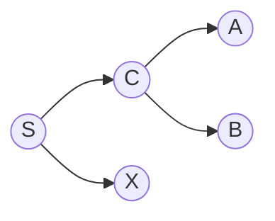

图由顶点集合和边集合组成，写成 $G=(V,E)$，其中$V$是顶点集合，$E$是边集合。

其中边用两个顶点组成的二元组表示，比如 $(u, v) \in E$ 表示图 $G$ 中 $u$ 和 $v$ 之间有一条边，其中 $u$ 指向 $v$

## Graph Representation

有两种表示：
- 邻接表
- 邻接矩阵

这两种设计在各个操作的差别见 [CS61B Graph Representation](https://blog.z0z0r4.top/2026/01/18/CS61B-Note-Collection/#graph-representation)

其中还有 CSR（Compressed Sparse Row）表示，将邻接表压缩到两个数组中，缺点是无法动态添加边，适合静态图的存储。

表示的不同有不同的算法设计，复杂度也大不相同。

---

> 22.1-3
> 有向图 $G=(V,E)$ 的转置是图 $G^T=(V,E^T)$，其中 $E^T=\{(v,u) \in V \times V : (u,v) \in E\}$。因此，图 $G^T$ 就是将有向图 $G$ 中所有边的方向反过来而形成的图。对于邻接链表和邻接矩阵两种表示，请给出从图 $G$ 计算出 $G^T$ 的有效算法，并分析算法的运行时间。

首先考虑邻接表的，直接按节点获取所有邻居，然后将邻居的边反过来添加到新的图中，时间复杂度为 $O(V+E)$。

对于邻接矩阵，可以直接转置矩阵，时间复杂度为 $O(V^2)$。

## BFS

这是一份 BFS 实现。

```cpp
#include <iostream>
#include <vector>
#include <queue>

using namespace std;

struct Vertex
{
    int id;
    char color; // 'W' for white, 'G' for gray, 'B' for black
    int distance;
};

class UndirectedMatrixGraph
{
private:
    vector<vector<int>> matrix;
    vector<Vertex> vertices;

public:
    UndirectedMatrixGraph(int V)
    {
        matrix.resize(V, vector<int>(V, -1));
        vertices.resize(V);
        for (int i = 0; i < V; i++)
        {
            matrix[i][i] = i;
            vertices[i].id = i;
            vertices[i].color = 'W';
            vertices[i].distance = 0;
        }
    }

    bool hasEdge(int u, int v)
    {
        return matrix[u][v] != -1;
    }

    void addEdge(int u, int v)
    {
        matrix[u][v] = v;
        matrix[v][u] = u; // For undirected graph
    }

    void setColor(int u, char color)
    {
        vertices[u].color = color;
    }

    void setDistance(int u, int distance)
    {
        vertices[u].distance = distance;
    }

    Vertex getVertex(int u)
    {
        return vertices[u];
    }

    vector<int> getNeighbors(int u)
    {
        vector<int> neighbors;
        for (int v = 0; v < matrix.size(); v++)
        {
            if (hasEdge(u, v))
            {
                neighbors.push_back(v);
            }
        }
        return neighbors;
    }
};

void bfs(UndirectedMatrixGraph &graph, int start)
{
    queue<int> q;
    graph.setColor(start, 'G');
    graph.setDistance(start, 0);
    q.push(start);

    while (!q.empty())
    {
        int current_id = q.front();
        Vertex current = graph.getVertex(current_id);
        vector<int> neighbors = graph.getNeighbors(current_id);
        for (const int neighbor : neighbors)
        {
            Vertex v_n = graph.getVertex(neighbor);
            if (v_n.color == 'W')
            {
                graph.setDistance(neighbor, current.distance + 1);
                graph.setColor(neighbor, 'G');
                q.push(neighbor);
            }
        }
        graph.setColor(current_id, 'B');
        q.pop();
    }
}
```

我们需要证明 $v.d = \delta(s, v)$，即 BFS 的正确性。

有以下引理：

1. 对于任意边 $(u, v) \in E$，有 $\delta(s, v) \le \delta(s, u) + 1$

    反证法：假设 $\delta(s, v) \gt \delta(s, u) + 1$，那么显然可以构造出一条 $s \rightarrow u \rightarrow v$ 的路径，长度为 $\delta(s, u) + 1$，假设不成立。

2. 对于任意顶点 $v$，有 $v.d \ge \delta(s, v)$

    假设：$v.d \ge \delta(s, v)$

    基础情况：当 $s$ 源顶点加入队列时，$s.d = 0$，其他节点为 $\infty$，满足假设。

    那么当顶点 $u$ 发现 $v$ 时，有 $u.d \ge \delta(s, u)$ 和 $v.d = u.d + 1。
    
    又因为 $(u, v) \in E$，所以 $\delta(s, v) \le \delta(s, u) + 1$，所以 $v.d = u.d + 1 \ge \delta(s, u) + 1 \ge \delta(s, v)$。则假设成立。

3. 队列 $Q$ 中为 $<v_1, v_2, \dots, v_r>$，其中 $v_1$ 是队头，$v_r$ 是队尾。

    证明有两个性质：
    1. $v_r.d \le v_1.d + 1$
    
    2. $i = 1, 2, \dots, r - 1, v_i.d \le v_{i+1}.d$

    首先考虑基础情况，当 $Q$ 中只有一个元素 $v_1$ 时，满足 $v_r.d = v_1.d \le v_1.d + 1$；

    改变队列的只有两种情况：入队和出队。按照代码中的顺序是，先出队 $u$，然后 $v_1$ 成为新的队头，最后 $v_{r+1}$ 入队替代 $v_r$ 成为新的队尾。

    归纳步骤：

    - 弹出 $u$ 后，$v_1$ 变成了新的队头，所以要证明性质 1（性质 2 不变）：
    - - 有性质 1： $v_r.d \le u.d + 1$ 
    - - 有性质 2： $u.d \le v_1.d$
    - - 所以 $v_r.d \le u.d + 1 \le v_1.d + 1$ 依旧成立。

    - 接下里是考虑 $v_{r+1}$ 入队时，要证明 $v_{r+1}.d \le v_1.d + 1$ 和 $v_r.d \le v_{r+1}.d$：
    - - 因为 $v_{r+1}$ 是由 $u$ 发现的，所以 $v_{r+1}.d = u.d + 1$
    - - 引用性质 2 得出性质 1： $v_1.d \ge u.d$，所以 $v_{r+1}.d = u.d + 1 \le v_1.d + 1$。
    - - 引用性质 1 得出性质 2： $u.d + 1 \ge v_r.d$，那么得到 $v_{r+1}.d = u.d + 1 \ge v_r.d$。

    那么两个假设依旧成立。

4. 按照入队顺序，$i < j$ 时，有 $v_i.d \le v_j.d$

    按照上面证明，且每个 $v$ 只会入队一次，所以成立。

但是以上都没约束到 $v.d = \delta(s, v)$。

用反证法证明，假设存在顶点 $v$ 使得 $v.d \ne \delta(s, v)$。

取 $s$ 到 $v$ 的最短路径上的父节点 $u$ 满足 $u.d = \delta(s, u)$。

因为 $v.d \ne \delta(s, v)$，那么根据第二点，得出 $v.d > \delta(s, v)$。

又因为是最短路径，可以得出 $\delta(s, v) = \delta(s, u) + 1$。

又因为 $u.d = \delta(s, u)$，所以 $$v.d \gt \delta(s, v) = \delta(s, u) + 1 = u.d + 1$$

得到这个式子之后可以具体讨论 $v$ 在 $u$ 出队的时候，$v$ 的三种颜色：

1. 假设 $v$ 是白色的，那么会赋值为 $v.d = u.d + 1$，和 $v.d \ge \delta(s, v) = u.d + 1$ 矛盾。

2. 假设 $v$ 是黑色的，那么 $v.d \le u.d$，因为 $v$ 在 $u$ 出队之前就被发现了。

3. 假设 $v$ 是灰色的，那么取 $w$ 为发现 $v$ 的顶点，则 $v.d = w.d + 1$，又因为 $w$ 在 $u$ 出队之前就被发现了，所以 $w.d \le u.d$，所以 $v.d = w.d + 1 \le u.d + 1$，矛盾了。

综上，说明假设不成立，所以 $v.d = \delta(s, v)$。

> 按照 22.2-3 提示，其实不需要区分 BLACK、GRAY 和 WHITE 三种颜色，直接用一个布尔值来表示是否被访问过，`bool visited` 即可。
> 
> 

广度优先搜索树就是 BFS 过程中，比如由 $u$ 为 $v$ 决定到 $s$ 的距离这样的 $(u, v)$ 连接起来组成的树，从 $s$ 到达每个节点的距离都是最短路径。

但是路径并不唯一，显然如下图：



可以有：



和



这取决于在遍历 $s$ 的邻居时，$u$ 和 $v$ 的顺序。

若 $u$ 在前，显然更先将 $u$ 的邻居 $w$ 加入队列，所以 $w$ 的父节点就是 $u$，反之亦然。

> 22.2-6
> 举出一个有向图 $G = (V, E)$ 的例子，对于源结点 $s \in V$ 和一组树边 $E_\pi \subseteq E$，使得对于每个结点 $v \in V$，图 $(V, E_\pi)$ 中从源结点 $s$ 到结点 $v$ 的唯一简单路径也是图 $G$ 中的一条最短路径；但是，不管邻接链表里结点之间的次序如何，边集 $E_\pi$ 都不能通过在图 $G$ 上运行 BFS 来获得。

~~想半天没想出来，看了眼答案大彻大悟了，简而言之是贪心~~



无法 BFS 得出：



只能得出：



或者



## The Diameter of a Tree

树的直径指的是树中任意两个节点之间的最长路径的长度。

可以很简单的发现直径的两端必然是树的叶子节点。

当确定直径的一端之后，另一端可以简单的从该端开始 BFS 来找到距离最远的节点得到。

有两种实现：

- 两次 BFS/DFS
- DP

### 两次 BFS/DFS

需要证明从任意节点 BFS 得到的距离最远的节点 $A$ 是树的直径的一端，以及从 $A$ BFS 得到的距离最远的节点 $B$ 是树的直径的另一端。

> 树的直径可以有多种，但长度相同。

先证明第一个结论：

假设直径的两端为 $A$ 和 $B$，从任意节点 $S$ BFS 得到的距离最远的节点为 $X$。

分两种情况：

- $S \rightarrow X$ 交 $A \rightarrow B$ 的路径于 $C$



- $S \rightarrow X$ 不交 $A \rightarrow B$



首先考虑第一种：

$$D_{A, B} = \delta(A, C) + \delta(C, B)$$

$$\delta(S, A) = \delta(S, C) + \delta(C, A)$$

由于 $\delta(S, A) \le \delta(S, X)$，所以 $\delta(S, C) + \delta(C, A) \le \delta(S, C) + \delta(C, X)$。

得出 $\delta(C, A) \le \delta(C, X)$。

那么很明显可以构造一条直径 $X \rightarrow C \rightarrow B$，长度为 

$$D_{X, B} = \delta(C, X) + \delta(C, B) \ge \delta(C, A) + \delta(C, B) = D_{A, B}$$

又因为前提是 $A \rightarrow B$ 是直径，所以 $D_{A, B}$ 是最长的路径，所以只能得到 $D_{X, B} = D_{A, B}$，即可以构造出等长的直径 $X \rightarrow C \rightarrow B$，假设成立。

对于第二种情况：

$$D_{A, B} = \delta(A, C) + \delta(C, B)$$

因为 $\delta(S, A) \le \delta(S, X)$，所以 $\delta(S, A) \le \delta(S, C) + \delta(S, X)$。

又因为显然 $\delta(S, A) \ge \delta(C, A)$，所以 

$$D_{A, B} = \delta(C, A) + \delta(C, B) \le \delta(S, A) + \delta(C, B) \le \delta(S, C) + \delta(S, X) + \delta(C, B) = D_{S, X}$$

> 也就是去掉一条 C -> A 的路径，添加一条 C -> S -> X 的路径，显然加上的 S -> X 比 S -> C -> A 更长，那自然比去掉的 C -> A 更长，更别说还有加上 C -> S 的路径了。

所以和 A -> B 是直径的条件矛盾了，情况二不成立。

综合情况一和情况二可知，第一次搜索找到的最远点 $x$ 必然是树中某条直径的一个端点。

第二个结论非常显然，固定端点 $A$，从 $A$ 开始 BFS 得到的距离最远的节点就是直径的另一端。

### DP

树的直径也可以通过 DP 来求解。

我的想法是对于树来说，要么直径经过根节点，要么不经过根节点（在子树内）。

如果经过根节点，其直径就是两棵子树的最大深度之和加上根节点。

所以定义 `dp[u]` 为以 $u$ 为根节点的子树的最大深度，那么对于每个节点 $u$，可以通过 `dp[u] = max(dp[x]) + 1` 来计算出 $u$ 的最大深度，其中 $x$ 是 $u$ 的子节点。

则 `ans = max(ans, dp[x] + dp[y] + 1)`，其中 $x$ 和 $y$ 是 $u$ 的两个子节点。

所以从叶子节点开始，向上合并子树，得到树的最大深度的同时计算出 `ans`，最终得到树的直径。

参考 [OI WIKI 的实现](https://oi-wiki.org/graph/tree-diameter/#%E4%BE%8B%E9%A2%98)：

```cpp
#include <algorithm>
#include <cstdio>
#include <vector>
using namespace std;

constexpr int N = 100000 + 10;

int n, d;
int dp[N];
vector<int> E[N];

void dfs(int u, int fa)
{
    for (int v : E[u])
    {
        if (v == fa)
            continue;
        dfs(v, u);
        d = max(d, dp[u] + dp[v] + 1);
        dp[u] = max(dp[u], dp[v] + 1);
    }
}

int main()
{
    scanf("%d", &n);
    for (int i = 1; i < n; i++)
    {
        int u, v;
        scanf("%d %d", &u, &v);
        E[u].push_back(v), E[v].push_back(u);
    }
    dfs(1, 0);
    printf("%d\n", d);
    return 0;
}
```

这里面将树当作无向图处理，所以会多一个 `if (v == fa) continue;` 来避免回到父节点。

此外这里写的很巧妙...我自己来写的话，取子树中的最长链和次长链来构成新直径，会显式的写成如下：

```cpp
static int max_diameter = 0;

int get_diameter(int u, int p) {
    int first_longest = 0;  // 最长链
    int second_longest = 0; // 次长链

    for (int v : adj[u]) {
        if (v == p) continue; // 避免回头访问父节点

        // 获取子树的最长路径
        int child_max_path = get_diameter(v, u) + 1;

        // 更新 first_longest 和 second_longest
        if (child_max_path > first_longest) {
            second_longest = first_longest;
            first_longest = child_max_path;
        } else if (child_max_path > second_longest) {
            second_longest = child_max_path;
        }
    }

    max_diameter = max(max_diameter, first_longest + second_longest);

    return first_longest;
}
```

虽然我知道状态转移方程是这样的，但写起来就会变成一堆逻辑判断...很丑陋。

> 参考中将最长链 + 次长链的信息求和放进结果 `d` 中（也就是我的实现里面的 `max_diameter`），然后在 `dp[u]` 中只存储最长链的信息。硬要说的话，可以发现 `dp` 中用过的节点的信息是没必要再存着的，我的实现里面唯一的好处就是空间占用略微小了点。

## DFS

首先放一份 DFS 实现：

```cpp
#include <iostream>
#include <vector>
#include <queue>

using namespace std;

struct Vertex
{
    int id;
    char color; // 'W' for white, 'G' for gray, 'B' for black
    int distance;
    int start_time;
    int finish_time;
};

class UndirectedMatrixGraph
{
private:
    vector<vector<int>> matrix;
    vector<Vertex> vertices;

public:
    UndirectedMatrixGraph(int V)
    {
        matrix.resize(V, vector<int>(V, -1));
        vertices.resize(V);
        for (int i = 0; i < V; i++)
        {
            matrix[i][i] = i;
            vertices[i].id = i;
            vertices[i].color = 'W';
            vertices[i].distance = 0;
        }
    }

    bool hasEdge(int u, int v)
    {
        return matrix[u][v] != -1;
    }

    void addEdge(int u, int v)
    {
        matrix[u][v] = v;
        matrix[v][u] = u; // For undirected graph
    }

    void setColor(int u, char color)
    {
        vertices[u].color = color;
    }

    void setDistance(int u, int distance)
    {
        vertices[u].distance = distance;
    }

    void setStartTime(int u, int time)
    {
        vertices[u].start_time = time;
    }

    void setFinishTime(int u, int time)
    {
        vertices[u].finish_time = time;
    }

    Vertex getVertex(int u)
    {
        return vertices[u];
    }

    vector<int> getNeighbors(int u)
    {
        vector<int> neighbors;
        for (int v = 0; v < matrix.size(); v++)
        {
            if (hasEdge(u, v))
            {
                neighbors.push_back(v);
            }
        }
        return neighbors;
    }

    vector<int> getAllVertex() {
        vector<int> allVertices;
        for (const Vertex &v : vertices) {
            allVertices.push_back(v.id);
        }
        return allVertices;
    }
};

void dfs(UndirectedMatrixGraph &graph)
{
    int global_time = 0;
    for (int vertex_id : graph.getAllVertex())
    {
        Vertex v = graph.getVertex(vertex_id);
        if (v.color == 'W')
        {
            dfsVisit(graph, vertex_id, &global_time);
        }
    }
}

void dfsVisit(UndirectedMatrixGraph &graph, int vertex_id, int *global_time)
{
    graph.setColor(vertex_id, 'G');
    graph.setStartTime(vertex_id, ++(*global_time));
    vector<int> neighbors = graph.getNeighbors(vertex_id);
    for (const int neighbor : neighbors)
    {
        Vertex v_n = graph.getVertex(neighbor);
        if (v_n.color == 'W')
        {
            dfsVisit(graph, neighbor, global_time);
        }
    }
    graph.setColor(vertex_id, 'B');
    graph.setFinishTime(vertex_id, ++(*global_time));
}
```

DFS 不维护队列，而是找到邻居就直接递归向下遍历，直到没有邻居了才回退。

BFS 构成一棵 BFS 树，但 DFS 构成的可能是森林（多棵树）：

- 无向图：如果是连通图，DFS 总是能一次性访问到所有节点，所以就是一棵树。

- 有向图：可能访问不到某些节点，需要回到 `dfs` 再选取剩下的节点作为起始节点，继续 DFS，直到访问完所有节点。可能有多棵树形成森林。

DFS 的时间复杂度也是 $O(V + E)$，因为每个节点和边都访问一次。

可以发现比 BFS 的实现，DFS 的 `Vertex` 的多了 `start_time` 和 `finish_time` 两个属性。这是为了方便引出以下的内容。

以下简称为属性 $u.s$ 和 $u.f$ 分别表示 $u$ 的 `start_time` 和 `finish_time`。

括号化定理（Parenthesis Theorem）：对于任意两个节点 $u$ 和 $v$，以下三种情况只有一种成立：

- $u$ 和 $v$ 互不为祖先：$[u.s, u.f]$ 和 $[v.s, v.f]$ 没有交集。

- $u$ 是 $v$ 的祖先：$[u.s, u.f]$ 包含 $[v.s, v.f]$。

- $v$ 是 $u$ 的祖先：$[v.s, v.f]$ 包含 $[u.s, u.f]$。

> 也就是不可能存在两个节点的开始时间和结束时间交错的情况。


根据如上的三个情况，显然可以推出 Nesting of descendants’ intervals（后代区间的嵌套）：当且仅当 $u$ 是 $v$ 的祖先时，满足 $u.s < v.s < v.f < u.f$。

> 从代码上观察递归嵌套，和时间戳截取的时机可以很容易观察得出，不证明=-=。

若 $v$ 是 $u$ 的后代，有另一个性质——White-path theorem，白色路径定理：

$v$ 是 $u$ 的后代**当且仅当**在 $u$ 的 `start_time` 时，存在一条全部由白色节点组成的路径从 $u$ 到 $v$。

> 注意是充要条件。

先证明 $v$ 是 $u$ 的后代 $\Rightarrow$ 在 $u$ 的 `start_time` 时，存在一条全部由白色节点组成的路径从 $u$ 到 $v$：

考虑 $u = v$ 设置 $u$ 的 `start_time` 时，显然 $u$ 还是白色的（没有置灰），所以成立。

当 $u \ne v$ 时，假设 $v$ 是 $u$ 的任意后代，又因为满足 $u.s < v.s < v.f < u.f$，所以有 $u.s < v.s$。节点 $v$ 在 $v.s$ 才置灰，前提说此刻是 $u.d$，所以任意后代 $v$ 都是白色节点，构成了一条从 $u$ 到 $v$ 的白色路径。

反过来证明，条件是存在白色路径。

假设 $v$ 不是 $u$ 的后代，那么取 $v$ 和 $u$ 的路径上的最后一个后代为 $w$，则满足 $w.f < u.f$。

因为 $v$ 不是 $u$ 的后代（也不是 $w$ 的后代）且存在边 $(w, v)$，那么 $v$ 应该在 $u.s$ 之后、$w.f$ 之前被访问到，所以 $u.s < v.s < w.f < u.f$，符合括号化定理中 $v$ 是 $u$ 的后代的情况，矛盾了，所以 $v$ 必然是 $u$ 的后代。

所以有白色路径相通则 $v$ 必然是 $u$ 的后代，反之亦然。

> DFS 本质是贪心的，那么有能连通的白色路径当然会成为后代，成为了后代当然得有连通的白色路径...读的力竭了

---

根据节点间的跳转，节点间的边分类可以有：

- 树边（Tree Edge）：DFS 过程中访问到一个未访问过（白色）的节点时的边。（即发现节点的边）
- 前向边（Forward Edge）：由祖先节点连接后代节点。
- 后向边（Back Edge）：由后代节点连接祖先节点。(注意，自身连接自身也算后向边)
- 交叉边（Cross Edge）：连接两个不具有祖先关系的节点。（可能跨树，也可能在同一棵树中）

书中给出了根据颜色判断边的类型：

- 白色节点：树边
- 灰色节点：后向边
- 黑色节点：前向边或交叉边（后续根据时间戳区分）

对于无向图来说，只有树边和后向边，因为无向图中不存在前向边和交叉边。

首先考虑前向边，考虑有向图的情况下，假设 $(u, v)$ 是前向边，必有两条路径使得 $u \rightarrow v$ 连通，比如先遍历了一条例如 $u \rightarrow x \rightarrow v$ 的路径，到达 $v$ 后发现边 $(u, v)$ 反向无法连通，所以回溯到 $u$，之后又遍历了一条 $u \rightarrow y \rightarrow v$ 的边，发现 $v$ 已经是 $u$ 的后代了，又回溯到 $u$，所以 $u \rightarrow v$ 就成了前向边。

然而无向图不存在方向，也就是在第一次发现 $v$ 之后，第二条路径 $u$ <-> $y$ <-> $v$ 是通的，所以会一直形成树边直到回到 $u$，不存在前向边，只会后代节点连接祖先节点形成后向边。

交叉边也来自于有向图的单向性质。若 $(u, v)$ 是交叉边，那么 DFS 先访问了 $v$，之后又访问了 $u$，而 $u$ 有指向已被访问的节点 $v$ 的边。倘若 $u$ 和 $v$ 之间的边是无向边，那么显然在访问 $v$ 的时候就会访问 $u$，所以 $u$ 和 $v$ 之间的边不可能是交叉边。

> 依旧归于贪心。

22.3-4 和 BFS 一样提示不需要区分黑色、灰色和白色三种状态，直接用一个布尔值 `visited` 来表示是否访问过即可。

> 中文版又错了，写错了行数，删第 8 行写成了删第 2 行...前面也有不少错误。比如无权图写成无向图。

22.3-7 提示 DFS 可以用栈来实现，消除递归。显然只要将父节点入栈，回溯时出栈即可。

```cpp
#include <stack>
#include <unordered_map>
#include <vector>

void dfs(UndirectedMatrixGraph &graph)
{
    int global_time = 0;
    std::stack<int> st;
    std::unordered_map<int, size_t> neighbor_idx;

    for (int vertex_id : graph.getAllVertex())
    {
        if (graph.getVertex(vertex_id).color == 'W')
        {
            st.push(vertex_id);
            graph.setColor(vertex_id, 'G');
            graph.setStartTime(vertex_id, ++global_time);
            neighbor_idx[vertex_id] = 0;

            while (!st.empty())
            {
                int u = st.top();
                auto neighbors = graph.getNeighbors(u);
                bool pushed_new = false;

                // 从上次访问的位置继续遍历未访问邻居
                for (size_t i = neighbor_idx[u]; i < neighbors.size(); ++i)
                {
                    int neighbor = neighbors[i];
                    if (graph.getVertex(neighbor).color == 'W')
                    {
                        neighbor_idx[u] = i + 1;

                        st.push(neighbor);
                        graph.setColor(neighbor, 'G');
                        graph.setStartTime(neighbor, ++global_time);
                        neighbor_idx[neighbor] = 0;

                        pushed_new = true;
                        break;
                    }
                }

                if (!pushed_new)
                {
                    graph.setColor(u, 'B');
                    graph.setFinishTime(u, ++global_time);
                    st.pop();
                }
            }
        }
    }
}
```

> 每次循环都获取栈顶顶点的邻居列表，如果没有新邻居（`pushed_new == 0`）入栈了，说明当前节点的所有邻居都访问过了，则出栈，否则将新邻居入栈，并记录这是第几个邻居。

22.3-5 中有以下边 $(u, v)$ 和时间戳的关系：

- 树边或前向边：$u.s \le v.s \le v.f \le u.f$ （$v$ 是 $u$ 的后代）
- 后向边：$v.s \le u.s \le u.f \le v.f$ （$u$ 是 $v$ 的后代）
- 交叉边：$v.s \le v.f \le u.s \le u.f$ （$v$ 已经被访问过了）

## Topological Sort

拓扑排序指的是将所有节点线性排序，使得对任意边 $(u,v) \in E$，$u$ 在排序中排在 $v$ 之前。

观察可得必须是有向无环图，如果是有环图显然会冲突。

按照图中观察也可以猜出是先 DFS 然后按照 `finish time` 的逆序来排序的。


通过以下两个证明来得出 DFS 的 `finish time` 的逆序就是拓扑排序：

1. 有向图是无环的当且仅当没有后向边。

    > 以下证明的都是逆否命题：有环当且仅当有后向边

    假设有后向边 $(u, v)$，那么 $v$ 是 $u$ 的祖先，其路径与边 $(u, v)$ 形成一个环。

    假设有环，假设其第一个被发现的节点为 $v$，则有 $(u, v)$ 和环上剩下的节点构成的一条从 $v$ 到 $u$ 的白色路径，则 $u$ 是 $v$ 的后代。而后代指向祖先的边就是后向边。

2. 有向无环图中，对于任意边 $(u,v) \in E$，在 DFS 中 $u.f > v.f$。

    $u$ 探索 $v$ 时，考虑 $v$ 的三种颜色：

    $v$ 不能为灰色，否则 $v$ 是 $u$ 的祖先，形成后向边，与上面的证明矛盾。

    当 $v$ 为白色，则 $v$ 是 $u$ 的后代，按照后代嵌套的性质，$v.f < u.f$。

    当 $v$ 为黑色，则 $v$ 在 $u$ 之前就已经置黑，显然 $v.f < u.f$。

    则 $u.f > v.f$ 成立，即 $\exists (u,v) \in E \Leftrightarrow u.f > v.f$。

## Strongly Connected Components (SCC)

强连通分量（SCC）指的是一个最大节点集合 $C \subseteq V$，使得对于任意 $u, v \in C$，都有 $u$ 到 $v$ 的路径和 $v$ 到 $u$ 的路径。

比如成环的节点集合可以是 SCC，多个环粘在一起则是一整个 SCC（单个节点也可以是）。

如上所说，图 $G(V, E)$ 可以被转置为 $G^T(V, E^T)$，其中 $E^T = \{(v, u) | (u, v) \in E\}$。

观察到 $G$ 中的 SCC 在 $G^T$ 中也是 SCC。

那么书中给到的寻找 SCC 的算法是：

1. 在 $G$ 上运行 DFS，记录每个节点的 `finish time`。

2. 转置图 $G$ 得到 $G^T$。

3. 在 $G^T$ 上按照 `finish time` 的逆序运行 DFS，每次 DFS 访问到的节点集合就是一个 SCC。

> 注意这里的逆序指的是最外层循环遍历节点的顺序，按照这个顺序去进入 `dfsvisit`，而不是在 `dfsvisit` 内部按照 `finish time` 的逆序去访问邻居。

如何证明正确性？

~~观察下面的图片就可以发现正确性，先 DFS 记录 `finish time`，之后转置图，任选一个节点进去 `dfs_visit` 就会发现只能访问到节点所在的 SCC，无法访问的其他的 SCC~~


以下三个步骤证明正确性：

1. 图 $G$ 中有两个不同的 SCC $C_1$ 和 $C_2$，使得 $u, v \in C_1$，$u', v' \in C_2$，假定存在路径 $u \rightarrow u'$，则不存在路径 $v' \rightarrow v$。

    反证法：假设存在路径 $v' \rightarrow v$，则 $C_1$ 和 $C_2$ 是连通的，合起来是同一个 SCC，矛盾了。

> $f(C)$ 定义为 $C$ 中所有节点的 `finish time` 的最大值。
>
> $d(C)$ 定义为 $C$ 中所有节点的 `finish time` 的最小值。

2. 图 $G$ 中有两个不同的 SCC $C_1$ 和 $C_2$，使得 $u \in C_1$，$v \in C_2$，存在边 $(u, v)$，$f(C_1) \gt f(C_2)$。

    覆盖两种情况：

    1. $d(C_1) \le d(C_2)$：则 $C_1$ 中第一个被发现的节点 $x$ 必然有一条白色路径通往 $C_1$ 和 $C_2$ 中的所有节点，则 $C_1$ (除去 $x$ 自身) 和 $C_2$ 中的所有节点都是 $x$ 的后代。根据后代嵌套区间，有 $x.f = f(C_1) > f(C_2)$。

    2. $d(C_1) \gt d(C_2)$：则 $C_1$ 中的所有节点在 $C_2$ 第一个节点被访问时还是白色的。又因为 $C_2$ 没有通向 $C_1$ 的边（$(u,v)$ 只能从 $C_1$ 通向 $C_2$），所以 $C_2$ 中的最后一个节点 $y$ 结束时，$C_1$ 中的所有节点都还是白色的，所以 $y.f = f(C_2) < f(C_1)$。

综上，第一次 DFS 遍历时，有边 $(u,v)$ 使得 $C_1$ 通向 $C_2$ 的情况下，$f(C_1) > f(C_2)$。（晚指向早）

那么接下来证明转置后是早指向晚：

3. 图 $G$ 中有两个不同的 SCC $C_1$ 和 $C_2$，使得 $u \in C_1$，$v \in C_2$，存在边 $(u, v) \in E^T$，则 $f(C_1) < f(C_2)$。

    由于 $(u, v) \in E^T$，那么存在 $(v, u) \in E$，根据上面的结论,，$f(C_2) > f(C_1)$。

所以，在转置后变成了早指向晚。

为了获取 SCC，只需要在第二次 DFS 时，从最晚的节点开始 `dfsVisit`，则其所在的 SCC 的 $f(C)$ 是最晚的，又因为早指向晚，所以无法从该节点访问到其他更早的 SCC（更晚的已经被访问过了），只能在这个 SCC 呢。

> 其实就是按拓扑排序的次序。