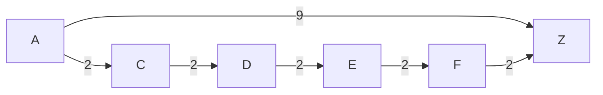

记录关于 Contraction Hierarchies 算法的记录。

<!-- more -->

> 封面取自 <https://jlazarsfeld.github.io/ch.150.project/>

今晚（其实已经是到第二天凌晨了=-=）看同学的 [多源最短路径 算法导论第25章](https://www.brokenvase.top/multi_sourse_shortest_paths) 里面拓展的 Contraction Hierarchies 始终觉得很奇怪，于是回到宿舍和 Gemini 讨论了一下，在此记录。

## 双向 Dijkstra

在此之前需要补充双向 Dijkstra（Bidirectional Dijkstra）的相关知识，同时从起点和终点进行搜索，直到两者相遇后（实际上的是保证没有更短的路径时）即停止。

随便找一个图，可以辅助理解下，搜索空间会比单向搜索要小不少。~~丑完了~~


但是依旧效率不够高，介于 Dijkstra 每次选择最短边，可以构建以下情况：



显然最短路径是 $A \rightarrow Z$，权重为 9。

按照 Dijkstra 的算法探索 $A \rightarrow Z$，会是 $A \rightarrow C \rightarrow D \rightarrow E \rightarrow F$，此时权重为 8。下一步发现 $A \rightarrow Z$ 的权重小于 $A \rightarrow C \rightarrow D \rightarrow E \rightarrow F \rightarrow Z$ 的权重 10，此时才会探索 $A \rightarrow Z$。

浪费了很多时间探索中间节点，但是却是无效的，这就是 Contraction Hierarchies 的创新点————通过构建捷径，强制查找过程变成倒 V 型的爬坡再下坡。

（这里没有直接显式的分层，比如按照 Geo 坐标指引先上“高速”，而是转化为 Rank 递增递减）

## Contraction Hierarchies

显然需要有办法直接走捷径而不是探索太多的中间节点，减少无效搜索。

先说一下 Contraction Hierarchies 的两个部分：

- 预处理
- - 先对节点以某种方式优先级排序
- - 依照排序取 $u$，为符合条件的 $s \rightarrow u \rightarrow v$ 添加捷径 (shortcut) $s \rightarrow v$
- 查询 $s \rightarrow t$ 的最短路径
- - 从 $s$ 和 $t$ 同时进行双向 Dijkstra 搜索，但是必须是升序

### 预处理

预处理阶段简单来说就是先决定节点的 Rank，然后按照 Rank 的顺序依次生成捷径，将“山谷”填平，最终使得任意两点之间的最短路径，是由 Rank 先严格升序再严格降序的节点构成的，存在一个 Peak 转折点，即为下文查找过程中，双向 Dijkstra 搜索时的交汇处。

```s
      u
    b   c
  a       d
S           V
```

#### 节点排序

节点排序是最重要的部分，目的是最小化最终捷径的数量，使得查询效率更高。（或者说是最小化每对 $s, v$ 搜索成本之和？）

按照 Wiki 中的说法，最优排序是 NP-Complete 的，所以实际中会使用启发式算法来近似求解。

构建启发式函数有几个关键指标：捷径的数量、节点的度数、均匀分布等。

> 太复杂了，要想细讲这个就只能翻论文了，看了一圈没有什么最优定义

此外还需要 Lazy Updating 懒更新，避免在每次添加捷径后都更新启发式函数值，成本太高。

#### 添加捷径（Witness Search）

由于搜索时搜索的是由捷径组成的图，所以要保证是和原图等价的。

首先考虑添加捷径的时候，不会影响最短路径的正确性:

对于处理 $s \rightarrow u \rightarrow v$，分两种情况：

- $s \rightarrow v$ 的最短路径不经过 $u$, 那么不会添加捷径（会由更短的路径的中间节点来添加捷径）

- $s \rightarrow v$ 的最短路径经过 $u$, 那么添加捷径$s \rightarrow v$ 的权重是 $w(s, u) + w(u, v)$，保持正确。

具体来说如何判断：从 $u$ 开始执行一次局部的 Dijkstra 搜索，目标是 $w$。在搜索时，屏蔽节点 $u$（即不允许走经过 $v$ 的路径），且搜索的深度或距离上限设定为 $w(s, u) + w(u, v)$。

#### 处理中间节点

有了添加捷径的逻辑之后，更高一层是按照 Rank 的顺序取节点 $u$ 作为中间节点，取其前驱节点集合为 $S$，后继节点集合为 $V$。

对于 $S$ 中的每个节点 $s$ 和 $V$ 中的每个节点 $v$，筛选满足 $rank(u) < rank(s)$ 和 $rank(u) < rank(v)$ 的节点对 $(s, v)$，如果 $s \rightarrow v$ 的最短路径经过 $u$，则添加捷径 $s \rightarrow v$。

构建捷径必须服务于后文的查找逻辑，所以要求 $rank(u) < rank(s)$ 和 $rank(u) < rank(v)$，目的是去掉不严格升序/降序的节点，构建捷径。

> 当 $rank(u) < rank(s)$ < rank(v)$ 时，$s \rightarrow u \rightarrow v$ 是严格升序的
>
> 当 $rank(u) < rank(v)$ < rank(s)$ 时，$s \rightarrow u \rightarrow v$ 是严格降序的
>
> 但总之目的是“填平”路径。

我想当时现场讨论和 Blog 内容（对每对入邻 u（u→v）和出邻 w（v→w）执行一次“witness search”），就是缺少了这个要求。并不是无条件对每对都处理，这样在后续查询要求递增/递减时会变成断路（我猜想）。

#### 记录绕过的中间节点

虽然查询时走的是捷径，但实际上输出结果时，显然需要复原通过的中间节点。

应该为每一条捷径记录被绕过的中间节点 $u$（长捷径是通过短捷径加上绕过的中间节点构成的）。

#### 构建正向图和反向图

正向图必须严格升序，反向图必须严格降序。

### 查询

查询时很简单，直接从 $s$ 和 $t$ 同时进行双向 Dijkstra 搜索，但是双向都必须是升序（即用正向图和反向图），直到两者相遇。

---

在此粘贴一份 Gemini 的总结：

<details>

Contraction Hierarchies (CH) 是现代路线规划（特别是静态路网）中最优雅、最高效的算法之一。它的核心魅力在于将寻找最短路径的问题，转化为在预处理好的“分层图（Hierarchical Graph）”**中寻找**“先升后降（Up-Down）”路径的问题。

为了彻底理清这个算法，我们可以将它拆解为预处理（Preprocessing）**和**在线查询（Query）两个主要阶段。以下是完整且严谨的执行过程。

---

一、 预处理阶段：节点排序（Node Ordering）

在进行任何收缩之前，算法首先需要给图中的每一个节点分配一个**重要度层级（Rank/Order）**。可以将其理解为节点被处理的优先级。

1. **评估节点重要性：** 系统会通过启发式策略（Heuristics）来评估每个节点。常见的评估指标包括：
* **边差度（Edge Difference）：** 收缩该节点会新增的 Shortcut 数量减去被移除的关联边数量。值越小，说明收缩它引入的额外边越少，优先级越高（越先被收缩）。
* **均匀分布（Uniformity）：** 避免将密集区域的节点连续收缩，尽量让收缩过程在整个图中均匀发生。


2. **分配 Rank：** 最终，所有节点被赋予一个从 $1$ 到 $n$ 的全局唯一标识 $rank(v)$。$rank$ 越小，代表越处于“底层”（如乡间小路交汇点）；$rank$ 越大，代表越处于“高层”（如高速公路枢纽）。

---

二、 预处理阶段：节点收缩与 Shortcut 插入

分配好 Rank 后，算法严格按照 Rank 从低到高的顺序，依次收缩（Contract）每一个节点。

假设我们当前正在收缩节点 $v$：

1. **寻找邻居：** 找出所有以 $v$ 为终点的入边 $(u, v)$ 和以 $v$ 为起点的出边 $(v, w)$。
* **关键限制：** 我们只关心那些**尚未被收缩**的邻居节点（即 $rank(u) > rank(v)$ 且 $rank(w) > rank(v)$）。


2. **见证者搜索（Witness Search）：** 对于每一对这样的前驱 $u$ 和后继 $w$，算法需要判断：**如果不经过 $v$，是否存在一条从 $u$ 到 $w$ 的等价或更短路径？**
* 从 $u$ 开始执行一次局部的 Dijkstra 搜索，目标是 $w$。
* 在搜索时，**屏蔽节点 $v$**（即不允许走经过 $v$ 的路径），且搜索的深度或距离上限设定为 $w(u, v) + w(v, w)$。


3. **判断与插入：**
* **不需要 Shortcut：** 如果局部搜索找到了一条路径，其长度 $L \le w(u, v) + w(v, w)$，则说明 $v$ 是可以被安全忽略的（即 $u \to v \to w$ 不是唯一的最短路）。我们什么都不用做。
* **插入 Shortcut：** 如果找不到更短的替代路径，说明 $u \to v \to w$ 就是局部最短的。为了保证去掉 $v$ 后，这一段的距离信息不丢失，我们**强制插入一条边**（Shortcut） $u \to w$，其权重为 $w(u, v) + w(v, w)$。同时在这条 Shortcut 上记录“生成者”是 $v$。


4. **移除节点 $v$：** 在逻辑上将 $v$ 从图中暂时移除，继续收缩下一个 Rank 更高的节点。

> **阶段产物：** 预处理结束后，我们得到了一张包含了**所有原图边 + 所有新生成的 Shortcut 边**的扩展图。

---

三、 构建向上图（Upward Graph）与向下图（Downward Graph）

在查询阶段，我们不需要在复杂的全图中漫无目的地搜索，而是利用节点的 Rank 将图拆分为两个子图：

* **向上图 $G_{\uparrow}$：** 只保留满足 $rank(x) < rank(y)$ 的有向边（包括原边和 Shortcut）。
* **向下图 $G_{\downarrow}$：** 只保留满足 $rank(x) > rank(y)$ 的有向边（包括原边和 Shortcut）。

由于所有边严格按照 Rank 单向流动，这两个子图都是**有向无环图（DAG）**。

---

四、 在线查询：双向 Dijkstra（Bidirectional Dijkstra）

查询阶段是整个 CH 算法的精髓。对于给定的起点 $s$ 和终点 $t$，算法执行双向搜索，但**有着极其严格的方向限制**。

1. **正向搜索（Forward Search）：**
* 从起点 $s$ 出发，维持一个优先队列。
* **核心限制：只能在向上图 $G_{\uparrow}$ 中进行。** 即当前在节点 $x$，只能沿着边走到 $y$，前提是 $rank(x) < rank(y)$。
* 记录正向距离 `distF`。


2. **反向搜索（Backward Search）：**
* 从终点 $t$ 出发，维持另一个优先队列。
* **核心限制：只沿着原图中的“入边”回溯，且同样只允许 Rank 升高。** 换句话说，如果在原图中存在边 $y \to x$，当前在 $x$ 的反向搜索只能走到 $y$，前提是 $rank(x) < rank(y)$。
* 记录反向距离 `distB`。


3. **相交与更新最佳距离：**
* 维护一个全局变量 `bestDist`（初始为 $\infty$）。
* 每当正向搜索和反向搜索都访问到了同一个节点 $m$ 时，计算 `distF[m] + distB[m]`。
* 如果 `distF[m] + distB[m] < bestDist`，则更新 `bestDist`，并记录此时的交汇节点 $m$（即最高点 Peak）。


4. **停止条件（Stopping Criterion）：**
* 当两个优先队列队首元素的最小值（即各自将要探索的最短可能距离）之和 $\ge bestDist$ 时，搜索停止。此时的 `bestDist` 就是真正的全局最短距离。

---

五、 路径还原（Path Unpacking）

双向搜索结束后，我们只得到了距离和一条由 Shortcut 及原边组成的混合路径 $s \to \dots \to m \dots \to t$。这在实际导航中是无法使用的，需要进行**解包（Unpacking）**。

1. 拿到最终构成最短路径的每一条边。
2. 检查边是否是 Shortcut：
* 如果是原边，保留。
* 如果是 Shortcut $(u, w)$，读取预处理时记录的**中间节点 $v$**。


3. 递归展开：
* 将 Shortcut $(u, w)$ 替换为 $(u, v)$ 和 $(v, w)$ 两条边。
* 如果拆分出来的边依然是 Shortcut，继续递归拆分，直到路径上的所有边全部退化为原图中的原始边。


4. 最终，输出这串原始的节点序列。

</details>

看到除此之外的还有 CCH 算法，可以在预处理和查询阶段之间额外添加一层，额外添加客制化处理，而无需从头构建。但越翻越发现都是搞路网、寻路的论文精读的 Blog 了...果断撤退。

TODO: 代码实现，Gemini 糊了下居然没糊出来...

## References

1. [Contraction Hierarchies - Wikipedia](https://en.wikipedia.org/wiki/Contraction_hierarchies)

2. [多源最短路径 算法导论第25章](https://www.brokenvase.top/multi_sourse_shortest_paths)

3. [Contraction Hierarchies: An Illustrative Guide](https://jlazarsfeld.github.io/ch.150.project/) 这个 Guide 配合图片不错